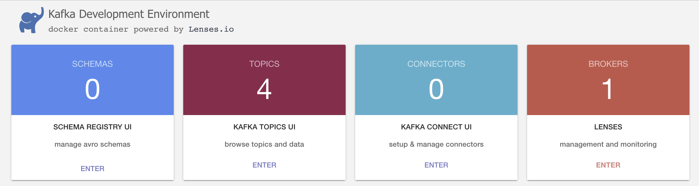
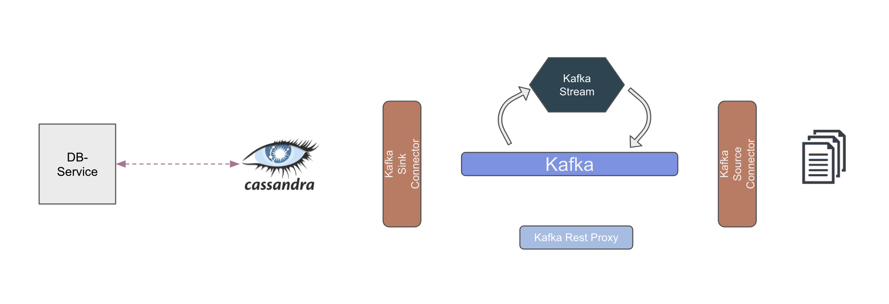

The aim of this project is to provide set of services that help the end customer to 
decide which website or retail shop they can use to buy their product by comparing data 
from different providers.


### Setup

Run `docker-compose up` command to run containerized services. You can use `docker-compose down` command to stop services.

#### Requirements

- Docker
- Gradle

### Usage

Kafka Cluster and related components can be monitored and managed by Landoop UI at `http://localhost:3030/`. This UI helps us to see topics, schemas and connectors.



##### Retrieve All Data

```
Endpoint: /products
Type: GET

http://localhost:9089/products
```

### Technical Details

##### Pipeline of the project




#### Integration

The pipeline supports reading and writing various data sources thanks to [Kafka Connectors](https://docs.confluent.io/platform/current/connect/index.html) for importing new product data.
In the project *File Stream Connector* is used to read data from file and *Cassandra Connector* is used to write processed data to the Cassandra as persistent storage.
Moreover, data also can be send by through [Kafka Rest Proxy](https://docs.confluent.io/platform/current/kafka-rest/index.html).

#### Validation and Enrichment

To be able to process the raw data written in the Kafka Topics, [Kafka Streams](https://docs.confluent.io/platform/current/streams/index.html) are used.
Stream processor, clean and validate data with basic checks, enrich it by adding timestamp and source information and convert it to [Apache Avro](https://avro.apache.org/) format.

Another significant enrichment that applied to data is adding ML score of the provider. *(In this project, did not train any model, all scores is given constantly for demonstration purpose.)*

#### Serving

Users can access our data using REST API. Spring Boot is used to handle these requests and database connection.

#### Future works
 - Elasticsearch can be added to retrieve related results.
 - Kubernetes scripts can be developed to run application on the Kubernetes Clusters.
 - More automation can be done to run application with a single command.
